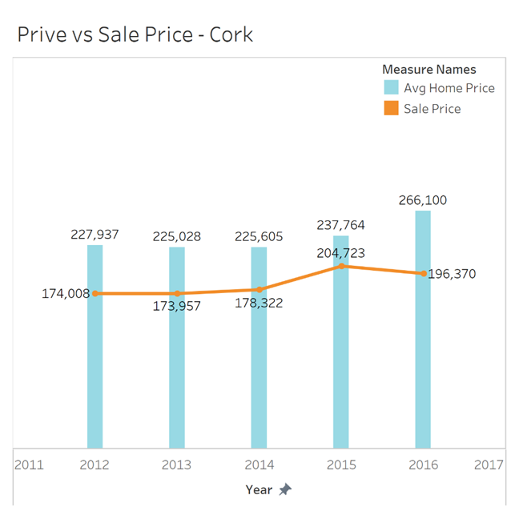

# Irish Housing Prices

This repo contains a code to scrape the latest housing prices info from [Daft.ie](https://www.daft.ie/) and combine this data with
historical records gathered from the CSO ([Central Statistics
Office](https://ws.cso.ie/public/api.restful/PxStat.Data.Cube_API.ReadDataset/HSQ06/XLSX/2007/en)) in Ireland to show a
comparison of housing prices over the years in Ireland for the main regions and cities

## Data Visualisations

This information was then imported into Tableau to better display it and tell a story

### Housing Distribution

From the image below we can see that of the homes listed on Daft.ie at the time of scraping this is the distribution of
homes throughout Ireland

### List Price Vs Sale Price

Below is an example of another visualisation used to interpret the cleaned data, an animated chart is used to show the
disparity between what homes are valued at and what they actually sell for in the major regions throughout the years

### Average Price by Region

Finally, another animated graph was used to display the average home prices from 2006 to 2016 and 2021 for each of the
different regions

